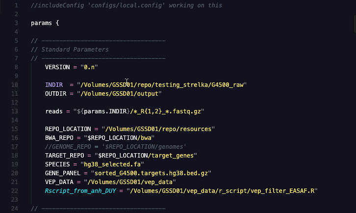

.. basic-usage-page:

Basic Usage
===========


Framework Stucture
------------------

Pipeline is a framework with various moving parts to support the development of multiple sequencing pipelines. The following is a simplified example of its directory structure::

      /G4500_workflow
      ├── README.md
      ├── docs
      │   └── source
      │       ├── G4500-seq.rst
      │       ├── _screenshots
      │       ├── basic-usage.rst
      │       ├── pipeline-structure.rst
      │       └── requirements.rst
      ├── pipelines
      │   ├── configs
      │   ├── templates
      │   │   ├── bbmap
      │   │   ├── bwa
      │   │   ├── fastqc
      │   │   ├── picard
      │   │   ├── strelka
      │   │   ├── vep
      │   │   └── vep_filter_using_R
      │   ├── working.config
      │   └── working.nf
      └── testing
          ├── working_021219.config
          └── working_021219.nf
           

**docs**
  Markdown and Restructured Text documentaion files associated with existing pipeline

**testing**
  The other pipelines used for testing
  
**pipelines/configs**
  Base config files inherited by pipeline configurations

**pipelines/templates**
  Template processes inherited by pipeline workflows

**pipelines/working.nf**
  Nextflow script for the G4500 pipeline

**pipelines/working.config**
  Configuration file for the G4500 pipeline


Pipeline Configuration
----------------------


   
Config Inheritance
``````````````````
**Line 1:** Configuration files can inherit basic properties that are reused across many pipelines.

Data Input and Output
`````````````````````
**Lines 8-22** All data paths and the pipeline parameters are defined in the configuration file. This includes specifying where incoming data resides as well as defining where to output all data produced by the pipeline.

Pipeline Execution
------------------
When the configuration file is set, run the pipeline with::
    
    nextflow working.nf -c working.config

If the pipeline encounters an error, start from where it left off with::
    
    nextflow working.nf -c working.config -resume

Output and Results
------------------

Once the pipeline has finished, all results will be directed to a single output folder specified in the configuration file.


Sample Folders
``````````````
Each sample contains its own individual folder that holds temporary and processed data that was created by each process. In the screenshot, one can see the aligned file specific to sample ``43-G1307M_S43`` that was generated by Burrows-Wheeler Aligner.


